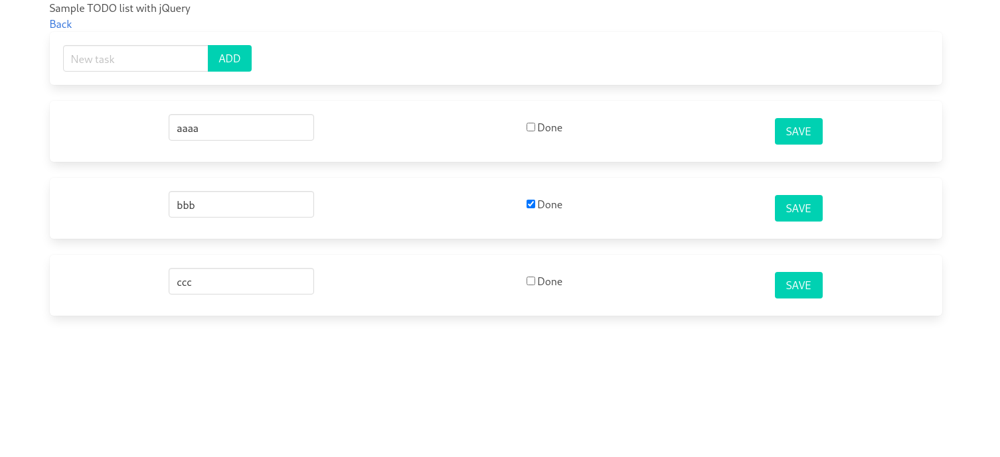

# sample java web progressive frontend

Proof of concept regarding transitional ways from jsp/jquery to jsp/vue
and SPA/vue.
An intermediate step intended to get acquainted with reactive frontends.



## what do i need to build this

- Java 8 or 11, maybe newer
- gradle 6.x latest

## how do i run this

type in the shell:

```bash
gradle cargoRunLocal
```

See `gradle tasks` for more options

tomcat will wait for you on <http://localhost:8080>
